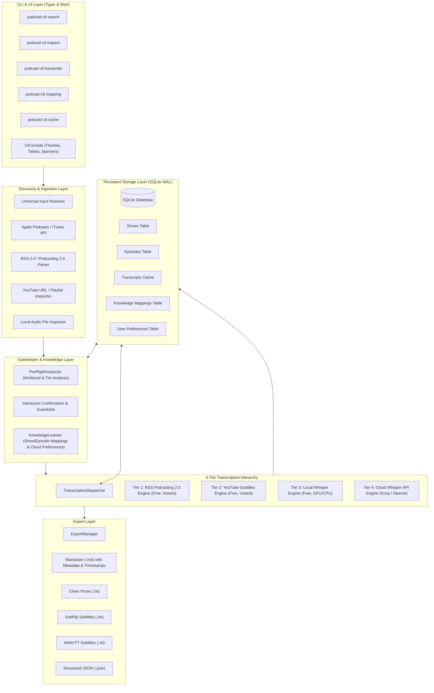
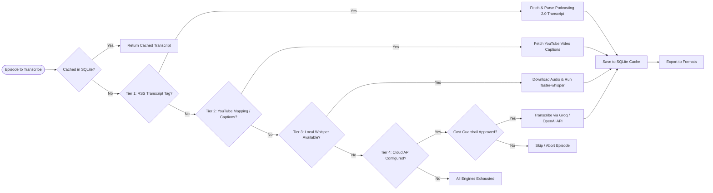
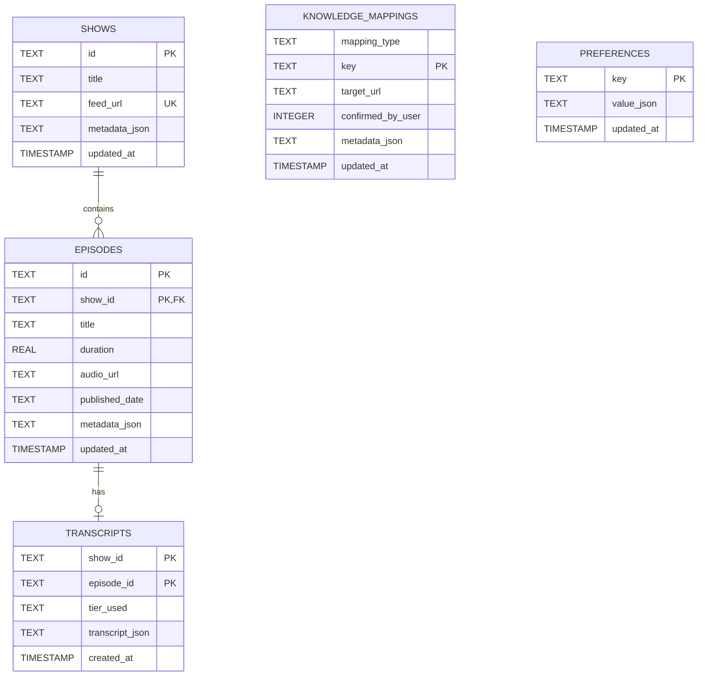

# podcast-ctl System Architecture

This document details the architectural design, component layers, data flows, and storage schema for `podcast-ctl`.

---

## 1. High-Level Architecture Overview

`podcast-ctl` is designed as a modular, tiered pipeline for podcast discovery, inspection, transcription, and multi-format export.

---

## 2. 4-Tier Fallback Hierarchy

The core transcription orchestration operates on an intelligent, cost-optimal 4-tier fallback model:

### Tier Breakdown

| Tier | Engine | Cost | Speed | Description |
| :--- | :--- | :--- | :--- | :--- |
| **Tier 1** | **RSS Podcasting 2.0** | $0.00 | Instant (<1s) | Downloads official publisher transcripts directly from `<podcast:transcript>` tags (SRT, VTT, JSON, Text, HTML). |
| **Tier 2** | **YouTube Captions** | $0.00 | Instant (1-3s) | Extracts official or auto-generated YouTube subtitles using learned Show $\leftrightarrow$ Channel and Episode $\leftrightarrow$ Video mappings. |
| **Tier 3** | **Local Whisper** | $0.00 | Moderate (1-5x realtime) | Downloads episode audio stream and transcribes locally using `faster-whisper` (CTranslate2) on Apple Silicon GPU / CUDA / CPU. |
| **Tier 4** | **Cloud Whisper API** | Pay-as-you-go (~$0.006/min) | Ultra-fast (10-30s) | Transcribes using Groq or OpenAI Whisper APIs when local compute is insufficient or explicitly requested. Guarded by interactive cost confirmation. |

---

## 3. Component Architecture & Responsibilities

### 1. CLI Layer (`podcast_ctl.cli`)
* Built with **Typer** and styled with **Rich**.
* **`search`**: Queries iTunes search catalog, presents results in formatted tables, and enables interactive downstream actions.
* **`inspect`**: Performs pre-flight dry runs estimating workload, duration, audio cache disk space, and tier distribution without executing transcription.
* **`transcribe`**: Coordinates discovery, episode filtering (`--episode`, `--latest`, `--all`), pre-flight confirmation, transcription dispatching with live spinners, and filesystem export.
* **`mapping`**: Manages learned Show $\leftrightarrow$ YouTube Channel and Episode $\leftrightarrow$ YouTube Video knowledge associations.
* **`cache`**: Inspects SQLite database metrics, lists cached transcripts, and cleans stored data.

### 2. Discovery & Ingestion Layer (`podcast_ctl.discovery`)
* **`resolve_input`**: Polymorphic input parser automatically detecting whether the input string is a local audio file, a YouTube link, an RSS feed URL, or a text search query.
* **`search_itunes` / `lookup_itunes`**: Robust iTunes API client with JSON parsing and normalized `PodcastSearchResult` models.
* **`fetch_and_parse_feed`**: Defused XML and feedparser wrapper parsing standard RSS 2.0 enclosures, iTunes tags, and Podcasting 2.0 transcript tags.
* **`inspect_local_file`**: Analyzes local `.mp3`, `.m4a`, `.wav`, `.aac`, `.flac`, `.ogg`, `.opus` audio files.
* **`parse_youtube_url`**: Parses video IDs, shorts, playlist IDs, and channel handles.

### 3. Gatekeeper & Knowledge Layer (`podcast_ctl.gatekeeper`)
* **`PreFlightInspector`**: Analyzes requested batches against local cache and available tiers, calculating total audio duration and estimated disk usage.
* **`prompt_batch_confirmation`**: Renders summary tables and requests user approval before executing long batch runs.
* **`prompt_youtube_mapping`**: Interactive disambiguation dialog when candidate YouTube videos are discovered.
* **`prompt_cloud_cost_approval`**: Financial safety guardrail estimating API costs before invoking paid cloud providers.
* **`KnowledgeLearner`**: Stores user-confirmed mappings and permissions into SQLite for zero-friction future executions.

### 4. Transcription Engine Layer (`podcast_ctl.engines`)
* **`TranscriptionDispatcher`**: Orchestrates cache verification, engine selection, and automatic fallback chains.
* **`RSSTranscriptionEngine`**: Handles Podcasting 2.0 transcript URLs with mime-type parsing.
* **`YouTubeTranscriptionEngine`**: Fetches transcripts via `youtube-transcript-api` and `yt-dlp`.
* **`WhisperTranscriptionEngine`**: Manages audio downloading, chunking, and local `faster-whisper` inference.
* **`CloudTranscriptionEngine`**: Integrates with Groq (`whisper-large-v3`, `whisper-large-v3-turbo`) and OpenAI (`whisper-1`) REST APIs.

### 5. Exporter Layer (`podcast_ctl.exporters`)
* **`ExportManager`**: Coordinates exporting normalized `TranscriptResult` objects to one or more formats.
* Supports **Markdown** (`.md`), clean **Prose** (`.txt`), **SubRip** (`.srt`), **WebVTT** (`.vtt`), and structured **JSON** (`.json`).
* Generates filesystem-safe directory hierarchies: `<output_dir>/<show-slug>/<episode-slug>.<ext>`.

### 6. Storage & Database Layer (`podcast_ctl.storage`)
* Persistent SQLite database configured with **WAL** (Write-Ahead Logging) mode and `synchronous=NORMAL` for concurrent safety.
* Encapsulated through `StorageRepository` with clean CRUD methods for domain entities.

---

## 4. Database Storage Schema

### Table Specifications

1. **`shows`**: Stores podcast show information, canonical RSS URLs, and metadata.
2. **`episodes`**: Indexes episode IDs, show relationships, media URLs, durations, and publication dates.
3. **`transcripts`**: Stores complete `TranscriptResult` JSON payloads keyed by `(show_id, episode_id)` for instant cache hits.
4. **`knowledge_mappings`**: Stores persistent associations between RSS feeds and YouTube channels, and podcast episodes and YouTube videos.
5. **`preferences`**: Stores user settings, cloud approval flags (`cloud_allowed:<show_id>`), and custom preferences.
